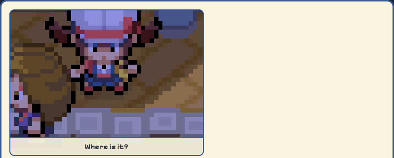
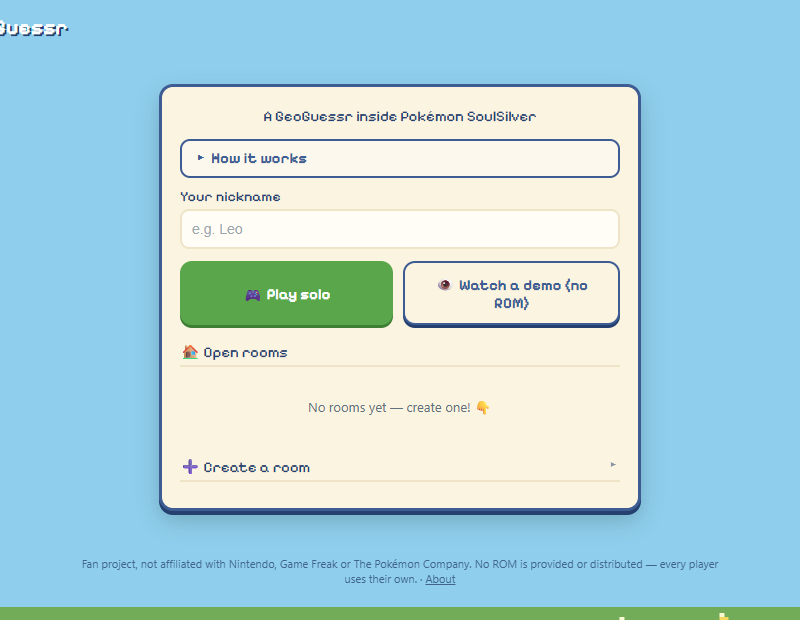

# 🎯 PokéGeoGuessr

🇫🇷 [Version française](README.fr.md)

> A **multiplayer GeoGuessr inside Pokémon SoulSilver**. The game shows a
> screenshot of a place that slowly zooms out; the first player to **walk their
> character** there (in the emulator) scores the point. Everything runs **in the
> browser** — nothing to install.

**▶ Live beta: https://pokegeoguessr.onrender.com**
**💬 Discord: _(coming soon)_**

<p align="center">
  
  <br><em>Demo mode (no ROM needed): the screenshot zooms out, then the place is revealed on the Pokégear map.</em>
</p>

<p align="center">
  
</p>

## How to play

1. Open the site and **create or join a room** (difficulty, region, max
   players, optional password).
2. Load **your own SoulSilver ROM (.nds)** — it stays on your machine, nothing
   is sent to the server. The emulator starts right in the tab.
3. Everyone walks around for a bit; when all players are ready, **the host
   starts the game**.
4. A heavily zoomed-in screenshot appears and slowly **zooms out**. Run to the
   place with your character: finding it early (while the image is still
   blurry) earns more points. A **"clutch" window** gives the others ~30 s to
   catch up.
5. **First to 10 points** wins the game.

**Hot/cold** hints from Poké Ball to Master Ball, 3 difficulty modes, a touch
gamepad to play on a phone, and an end-of-round reveal on the Pokégear map.

## Under the hood

- **Server**: Node + Express + **Socket.IO** — rooms, rounds, zoom-out, win
  detection by **comparing coordinates**.
- **In-browser emulator**: melonDS compiled to **WASM** (DS Anywhere /
  WebMelon) with a free BIOS — no proprietary BIOS required.
- **Position reading**: the emulator's RAM is scanned (game code `IPGF`) to read
  the player's coordinates, compared with the target ± a margin.
- **Screenshots**: real in-game captures, cropped and zoomed **server-side** (the
  full map never reaches the client, so no cheating).

## Local development

```bash
npm install
npm start        # http://localhost:3000
```

`config.json`: zoom-out interval, detection margin, target score, length of the
clutch window. `public/sim.html` is a simulator (arrow-key movement) to test the
game loop **without an emulator or ROM**.

## Structure

```
server/                game server (Node + Socket.IO)
public/                web client (game + simulator + assets)
gamepacks/hgss_photos/ SoulSilver pack served to players (screenshots + calibration)
tools/                 ROM extraction (walkability, warps, indoor spots…)
bridge/                bridge to an external emulator (advanced mode, optional)
config.json            game settings
```

## Status

**Beta.** Feedback and ideas are welcome on the Discord. The hosting server
will change to handle more players.

## ⚖️ Disclaimer

**Fan project**, **not affiliated with Nintendo, Game Freak or The Pokémon
Company**. No ROM is provided or distributed — every player uses **their own
legal copy** of the game. "Pokémon", "SoulSilver" and related names belong to
their respective owners. The code in this repository is MIT-licensed; the
license does not cover third-party content.
